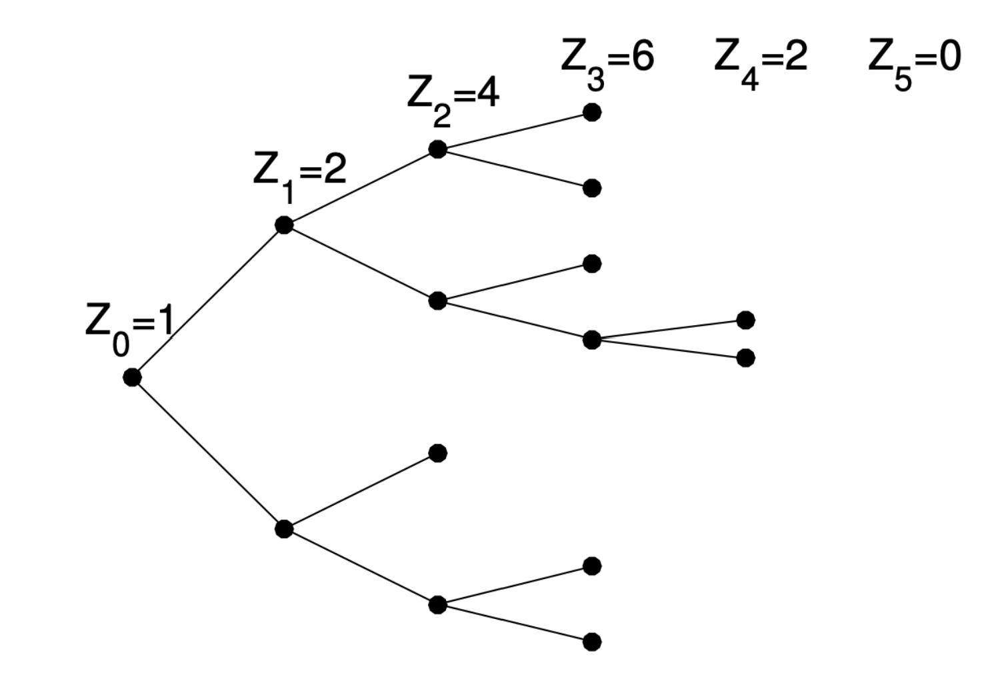

<p align="center">
  
</p>

# Processus de Galton-Watson et réaction en chaîne
 
## Description 🔎

Le processus de Galton-Watson est un modèle de dynamique de population permettant de modéliser certains phénomènes évolutifs, comme :

- Les réactions nucléaires en chaîne,
- L'étude de la transmission des gènes,
- La survivance des noms de famille.

Ce modèle repose sur une suite de variables aléatoires représentant le nombre d'individus à chaque génération, chaque individu ayant un certain nombre de descendants selon une loi de probabilité donnée.

## Formulation du Modèle 🛠️

Soit une variable aléatoire $( X )$ suivant une loi de probabilité donnée. Considérons une famille de variables aléatoires $( (X_{i,n}) )$ indépendantes et identiquement distribuées selon la loi de $( X )$.  
Nous définissons alors la suite $( (Z_n) )$ par la relation de récurrence :
```math

Z_{n+1} = \sum_{i=1}^{Z_n} X_{i,n}

```
où $( Z_n )$ représente le nombre d'individus à la génération \( n \).

Deux probabilités clés sont étudiées :

- $( \pi_n = P(Z_n = 0) )$ : la probabilité d'extinction à la génération \( n \),
  $( P_{ext} = P(\exists n \in \mathbb{N}, Z_n = 0) )$ : la probabilité d'extinction totale de la population.

## Exemple d'utilisation 📖

Un exemple classique du processus de Galton-Watson concerne des particules capables de générer des particules de la même famille.  
Chaque particule engendre un nombre de descendants selon une loi de probabilité fixe au cours des générations.

Exemple avec une loi de Bernoulli de paramètre $( p = \frac{1}{2} )$ :

- Génération 0 : 1 individu,
- Génération 1 : 2 individus,
- Génération 2 : 4 individus,
- Génération 3 : 6 individus,
- Génération 4 : 2 individus,
- Génération 5 : extinction.

## Objectifs du Projet 🚀

Ce projet vise à simuler et analyser le processus de Galton-Watson à l'aide du langage **R**.  
Les objectifs principaux sont :

1. **Simulation du processus**  
   - A l'aide de la fonction fonction `generation_n_exo1` en **R** pour simuler l'évolution de la population à la génération \( n \).

2. **Estimation de la taille moyenne de la population**  
   - A l'aide de la fonction fonction `taille_moyenne_n_exo1` pour approximer la taille moyenne de la population à la génération \( n \).

3. **Calcul des probabilités d'extinction**  
   - Estimation de  $( \pi_n = P(Z_n = 0) )$ pour différentes valeurs de $( n )$
   - Estimation de la probabilité d'extinction totale $( P_{ext} )$.

4. **Estimation du nombre moyen de générations avant extinction**  
   - Calcul du nombre moyen de générations avant que la population disparaisse.


